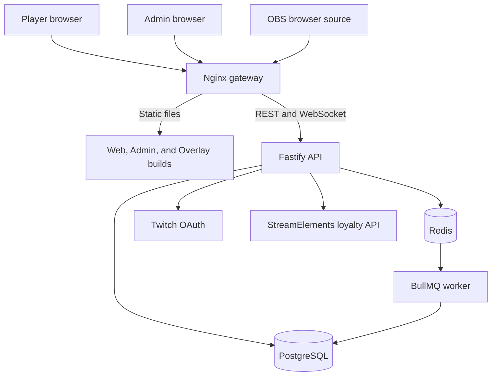

# Neon Wreckers: Station Zero

> A server-authoritative, mobile-first stream game built around cooperative salvage, persistent station progression, Twitch identity, StreamElements loyalty support, streamer controls, and a live OBS browser overlay.


Neon Wreckers combines a player-facing web game, a streamer administration console, an OBS browser overlay, a Fastify API, and an asynchronous expedition worker in one production deployment.

Game state is authoritative on the server. Browsers display state and request actions, but they do not calculate rewards, select loot, bypass cooldowns, spend inventory, or directly modify persistent data.

This README describes the capabilities present in the current source tree. External services such as Twitch, StreamElements, DNS, TLS, and OBS still require valid deployment configuration before those features become available on a live server.

## Contents

- [Current release status](#current-release-status)
- [Compatibility](#compatibility)
- [Current capabilities](#current-capabilities)
- [Core gameplay loop](#core-gameplay-loop)
- [Architecture](#architecture)
- [Repository structure](#repository-structure)
- [Requirements](#requirements)
- [Local development](#local-development)
- [Production deployment](#production-deployment)
- [Public routes](#public-routes)
- [Configuration](#configuration)
- [Common commands](#common-commands)
- [Testing and verification](#testing-and-verification)
- [Backups, updates, and restores](#backups-updates-and-restores)
- [Documentation](#documentation)
- [Security](#security)
- [Development rules](#development-rules)
- [License and distribution](#license-and-distribution)

## Current release status

Neon Wreckers 2.0 currently includes:

- A responsive player web application
- Twitch OAuth authentication and persistent player sessions
- Persistent station, player, ship, crew, inventory, and expedition data
- Salvage, construction, expedition, reward, history, and notification systems
- A streamer and administrator control center
- An optional StreamElements loyalty integration
- A transparent OBS browser-source overlay with live game telemetry
- PostgreSQL persistence, Redis-backed delayed jobs, and a dedicated worker
- A single supported Docker Compose production deployment
- Source-controlled game content, balance values, visual keys, themes, events, and seasons

The project is a browser-based stream game. It is not currently distributed as a native Android, iOS, Windows, macOS, or console application.

Gameplay is driven through the web interface. Twitch is currently used for identity and streamer integration rather than requiring viewers to flood chat with gameplay commands.

## Compatibility

### Player and administration clients

| Surface | Current target | Notes |
| --- | --- | --- |
| Player game | Current Chrome, Edge, Firefox, and Safari releases | Responsive layout intended for phones, tablets, laptops, and desktops |
| Android | Current Chrome-based browsers | Touch controls and responsive layout; no native APK is required |
| iPhone and iPad | Current Safari releases | Runs as a web application; no native App Store build is provided |
| Streamer administration | Current desktop and tablet browsers | Larger screens are recommended for dense configuration and audit views |
| Input | Touch, mouse, and keyboard | Game actions are UI-driven rather than controller-dependent |
| Network | HTTPS, cookies, JavaScript, REST, and WebSockets | Authentication and live updates require normal browser storage and network access |

Only current browser versions should be treated as supported targets. The repository does not currently publish a formal automated browser-version certification matrix.

Embedded social-media browsers can restrict cookies, popups, or OAuth redirects. Players should open the game in their normal browser if Twitch sign-in fails inside an embedded browser.

### OBS and broadcast software

The overlay is designed for the Chromium-based OBS Browser Source and similar browser-source implementations.

Recommended OBS setup:

| Setting | Recommendation |
| --- | --- |
| Source type | Browser Source |
| URL | `https://YOUR_HOST/overlay/` |
| Canvas | 1920×1080 or 2560×1440, 16:9 |
| Background | Transparent |
| Shutdown source when not visible | Optional |
| Refresh browser when scene becomes active | Optional, useful during configuration changes |
| Custom CSS | Not required for the standard layout |

The overlay includes:

- Transparent rendering for compositing over gameplay
- Responsive scaling for common broadcast sizes and shorter canvases
- Station telemetry and wreck intelligence panels
- Rotating event and breaking-news presentation
- Live WebSocket updates
- Automatic reconnect behavior
- Polling support for state recovery
- Reduced-motion handling
- Higher-contrast adjustments where supported by the browser source
- Source-controlled position, scale, timing, theme, visibility, and feed settings

No custom OBS plugin is required.

### Twitch compatibility

Twitch support currently includes:

- Real Twitch OAuth sign-in
- Twitch user identity linked to persistent game records
- Streamer identity and role enforcement
- Viewer-presence events used by the live overlay
- Server-side Twitch configuration and callback validation

Twitch chat commands and Twitch Channel Point redeem triggers are not the primary gameplay interface in the current release.

### StreamElements compatibility

StreamElements support is optional and server-side.

When configured, it provides:

- Loyalty provider health checks
- Point-funded action support
- Idempotent point transactions
- Durable transaction records
- Compensation tracking when an action fails after a point operation
- Administrative transaction review

The game can run with StreamElements disabled. Point-funded routes must remain disabled unless a valid channel ID, broadcaster-owned JWT, and provider configuration are present.

### Server and deployment compatibility

The supported production target is:

- Ubuntu 24.04 LTS
- Docker Engine with the Docker Compose plugin
- A public DNS hostname
- Inbound TCP ports 80 and 443
- Outbound HTTPS access
- PostgreSQL 16
- Redis 7

Other Linux distributions or container hosts may work, but they are not the documented production target.

### Accessibility and current limits

Current accessibility-oriented behavior includes responsive layouts, touch-friendly controls, reduced-motion support in the broadcast interface, and higher-contrast overlay adjustments.

The project has not yet published a complete WCAG conformance audit. Accessibility behavior should be regression-tested whenever navigation, animation, color, typography, or interaction patterns change.

Current limitations:

- No offline gameplay
- No native mobile or desktop application
- No controller-specific interface
- No static-host-only deployment because the game requires the API, database, and worker
- No synthetic production login or mock Twitch user
- No guarantee that embedded browsers will complete OAuth correctly
- External integrations require real credentials and cannot be fully verified in an isolated source build

## Current capabilities

### Player application

- Twitch OAuth sign-in with database-backed sessions
- Persistent player profile and progression
- Persistent ship, crew, inventory, and station state
- Wreck scanning
- Salvage deployment with server-authoritative outcomes
- Item rewards and inventory merging
- Cooldown enforcement
- Construction material contributions
- Station-module progression
- Expedition launching
- Delayed expedition resolution
- Expedition reward claiming
- Station history and player notifications
- Quarters, marketplace, ship, crew, and inventory views
- Mobile-first responsive interface
- Shared visual language across the game and broadcast overlay

### Salvage and wreck systems

- Canonical source-controlled wreck definitions
- Risk and reward ranges
- Server-selected salvage outcomes
- Current-wreck state shared with the player interface and overlay
- Streamer-controlled wreck spawning through the authoritative game service
- Durable history entries and live broadcast events
- Concurrency protection against duplicate rewards or conflicting state changes

### Station construction and progression

- Persistent station integrity, power, morale, population, storage, and module state
- Material contribution tracking
- Deterministic construction completion rules
- Canonical module definitions and requirements
- Shared station updates across player, admin, and overlay clients
- Historical records for major station changes

### Expeditions

- Player-owned expedition records
- Server-authoritative launch validation
- Delayed resolution through Redis and BullMQ
- Dedicated worker processing
- Deterministic timing and reward rules
- Bounded retries and unknown-job rejection
- Atomic reward claiming to prevent duplicate claims
- Notifications and history entries for expedition outcomes

### Streamer administration

- Streamer and administrator role enforcement
- Station status and integration status views
- Wreck spawning
- Versioned configuration records
- Audit logging
- StreamElements health visibility
- StreamElements transaction review support
- Server-authoritative administrative actions
- Shared design system and visual treatment with the player application

### OBS overlay

- Public, read-only broadcast surface
- Transparent browser-source rendering
- Station telemetry
- Current wreck telemetry
- Alerts and system notices
- History-driven headline feed
- Viewer-presence notices
- Realtime events including station, wreck, history, and presence updates
- Automatic WebSocket reconnection
- Safe handling of malformed broadcast packets
- Configurable layout, scale, visibility, timing, colors, scanlines, panel treatment, and breaking-news behavior
- Responsive layouts for common stream canvases
- Reduced-motion support

### Backend and data integrity

- Fastify API
- Zod input and environment validation
- Structured API success and error envelopes
- Request IDs
- Security headers
- CORS controls
- Rate limiting
- Signed, HTTP-only session cookies
- PostgreSQL as the durable source of truth
- Redis for queue infrastructure
- Prisma schema, migrations, and seed data
- Database locks and conditional transitions for concurrency-sensitive actions
- Idempotency records for point-funded actions
- Server-side provider credentials
- WebSocket event distribution

### Content and customization

Game content is source-controlled and data-driven rather than scattered through browser components.

The content layer supports definitions for:

- Items and currencies
- Wrecks
- Station modules
- Initial station state
- Gameplay balance
- Expeditions
- Events
- Seasons
- Themes
- Visual asset keys

The asset manifest is the canonical registry for referenced artwork. New content should be added through the validated content files and manifest rather than hardcoded into route handlers or UI screens.

### Operations

- One root Dockerfile
- One root Compose deployment
- Nginx gateway with TLS termination
- HTTP-to-HTTPS redirect
- WebSocket proxy support
- Install, update, verify, backup, and restore scripts
- Database migration and idempotent seed execution
- Health and readiness endpoints
- Certificate renewal support
- Backup retention controls
- Repository verification gates
- Canonical GitHub-to-VM synchronization workflow

## Core gameplay loop

1. A viewer opens the player site and signs in with Twitch.
2. The player scans for an available wreck.
3. The player deploys a salvage action.
4. The server validates cooldowns, inventory, player state, and current wreck state.
5. The authoritative game engine resolves the outcome and persists rewards.
6. Salvaged materials can be contributed to station construction.
7. Players can launch timed expeditions and later claim resolved rewards.
8. Station, wreck, history, notification, and overlay state update for connected clients.
9. Streamer-controlled events can change the immediate salvage target or broadcast state without bypassing normal game rules.

## Architecture



The gateway exposes four primary surfaces:

| Path | Purpose |
| --- | --- |
| `/` | Player application |
| `/admin/` | Streamer control center |
| `/overlay/` | OBS browser overlay |
| `/api/` | API and WebSocket proxy |

The API owns identity, game state, inventory, cooldowns, rewards, construction, expeditions, loyalty transactions, and administrative operations.

PostgreSQL is the only durable runtime datastore. Redis supports queues and delayed work but is not a second source of truth.

## Repository structure

```text
.
├── apps/
│   ├── web/                 Player-facing React application
│   ├── admin/               Streamer control center
│   ├── overlay/             OBS browser-source application
│   ├── api/                 Fastify API
│   └── worker/              BullMQ expedition worker
├── packages/
│   ├── game-engine/         Deterministic gameplay rules
│   ├── content/             Validated content loader and typed exports
│   ├── integrations/        Twitch, StreamElements, and Redis adapters
│   ├── browser-client/      Shared browser API client
│   ├── ui/                  Shared React design system
│   └── client-theme/        Shared theme and compatibility styling
├── content/                 Canonical game content and balance data
├── assets/                  Canonical visual-key manifest
├── infrastructure/
│   ├── database/            Prisma schema, migrations, and seed
│   └── gateway/             Production Nginx configuration
├── scripts/                 Install, update, verify, backup, and restore
├── tools/                   Repository and content quality gates
├── docs/                    Architecture and operating documentation
├── Dockerfile               Multi-stage application build pipeline
├── compose.yaml             Supported production deployment
├── pnpm-workspace.yaml      Workspace definition
└── pnpm-lock.yaml           Canonical dependency lockfile
```

## Requirements

### Development

- Node.js 22.16 or newer
- Corepack
- pnpm 10.32.0
- PostgreSQL 16-compatible server
- Redis 7-compatible server
- A Twitch development application for real OAuth sign-in

`pnpm-lock.yaml` is canonical. Do not generate or commit npm or Yarn lockfiles.

### Production

- Ubuntu 24.04 LTS host
- Public DNS hostname pointed at the host
- Inbound TCP ports 80 and 443
- Docker Engine with the Compose plugin
- Outbound HTTPS access for packages, container images, certificate issuance, Twitch, and StreamElements

## Local development

Enable the pinned package manager:

```bash
corepack enable
corepack prepare pnpm@10.32.0 --activate
```

Install the locked workspace dependencies:

```bash
pnpm install --frozen-lockfile
```

Create local configuration:

```bash
cp .env.example .env
chmod 600 .env
```

Provide reachable PostgreSQL and Redis services, then update `DATABASE_URL`, `REDIS_URL`, and the Twitch callback settings in `.env`.

Apply the database migration and seed:

```bash
pnpm db:migrate
pnpm db:seed
```

Run the backend processes in separate terminals:

```bash
pnpm --filter @neon-wreckers/api dev
pnpm --filter @neon-wreckers/worker dev
```

Run the browser clients as needed:

```bash
pnpm --filter @neon-wreckers/web dev
pnpm --filter @neon-wreckers/admin dev
pnpm --filter @neon-wreckers/overlay dev
```

The Vite clients use same-origin `/api` requests and proxy them to the local API during development.

Synthetic users and mock production authentication are not supported.

## Production deployment

Neon Wreckers has one supported production deployment: the root `compose.yaml`, built from the root `Dockerfile`.

Prepare the environment file:

```bash
cp .env.example .env
chmod 600 .env
```

Replace all example values, point the hostname at the server, then run:

```bash
sudo bash scripts/install.sh
```

The installer is responsible for:

1. Validating environment configuration.
2. Installing Docker and Certbot when required.
3. Validating the Compose configuration.
4. Building application and gateway images.
5. Obtaining the TLS certificate.
6. Applying migrations and the idempotent seed.
7. Starting PostgreSQL, Redis, API, worker, and gateway services.
8. Installing certificate-renewal and backup scheduling.
9. Checking public health endpoints.

See [docs/DEPLOYMENT.md](docs/DEPLOYMENT.md) before operating a production host.

## Public routes

| Route | Access | Description |
| --- | --- | --- |
| `GET /health` | Public | API process health |
| `GET /ready` | Public | API and database readiness |
| `GET /api/v1/ws` | Public | Realtime WebSocket feed |
| `GET /api/v1/auth/twitch/start` | Public | Begin Twitch OAuth |
| `GET /api/v1/me` | Authenticated | Current user and player record |
| `GET /api/v1/station` | Public | Current station state |
| `GET /api/v1/wrecks/current` | Public | Current wreck state |
| `GET /api/v1/history` | Public | Recent station history |
| `GET /api/v1/inventory` | Authenticated | Player inventory |
| `GET /api/v1/ships` | Authenticated | Player ships |
| `GET /api/v1/crew` | Authenticated | Player crew |
| `POST /api/v1/salvage/scan` | Authenticated | Scan for a wreck |
| `POST /api/v1/salvage/deploy` | Authenticated | Run a salvage action |
| `POST /api/v1/construction/contribute` | Authenticated | Contribute materials |
| `GET /api/v1/expeditions` | Authenticated | List player expeditions |
| `POST /api/v1/expeditions/launch` | Authenticated | Launch an expedition |
| `POST /api/v1/expeditions/:id/claim` | Authenticated | Claim resolved rewards |
| `GET /api/v1/admin/config` | Streamer or admin | Read configuration records |
| `POST /api/v1/admin/config` | Streamer or admin | Save a configuration version |
| `POST /api/v1/admin/actions/spawn-wreck` | Streamer or admin | Spawn a wreck |
| `GET /api/v1/integrations/streamelements/health` | Streamer or admin | Check loyalty integration health |

The complete route inventory and response format are documented in [docs/API_REFERENCE.md](docs/API_REFERENCE.md).

## Configuration

All production variables are documented in [docs/DEPLOYMENT.md](docs/DEPLOYMENT.md) and represented in [.env.example](.env.example).

Important groups include:

| Group | Variables |
| --- | --- |
| Public identity | `PUBLIC_HOST`, `PUBLIC_WEB_URL`, `CORS_ORIGINS`, `ACME_EMAIL` |
| Runtime | `NODE_ENV`, `TRUST_PROXY`, `COOKIE_SECURE`, `LOG_LEVEL`, rate-limit values |
| PostgreSQL | `POSTGRES_USER`, `POSTGRES_PASSWORD`, `POSTGRES_DB`, `DATABASE_URL` |
| Redis | `REDIS_PASSWORD`, `REDIS_URL` |
| Sessions | `SESSION_COOKIE_NAME`, `SESSION_SECRET` |
| Twitch | Client ID, client secret, redirect URI, scopes, streamer Twitch ID |
| StreamElements | Provider mode, channel ID, JWT, API base, point-action feature flag |
| Operations | `BACKUP_RETENTION_DAYS`, `IMAGE_TAG` |

Never commit `.env`, provider tokens, database dumps, backup archives, certificates, or support bundles containing secrets.

## Common commands

| Command | Purpose |
| --- | --- |
| `pnpm install --frozen-lockfile` | Install exact locked dependencies |
| `pnpm dev` | Start configured workspace development processes |
| `pnpm clean` | Remove generated output |
| `pnpm build` | Build all application and package targets |
| `pnpm test` | Run automated source checks |
| `pnpm verify` | Run the complete source verification gate |
| `pnpm test:engine` | Test deterministic gameplay rules |
| `pnpm test:api` | Test API and service behavior |
| `pnpm test:content` | Validate content and cross-file references |
| `pnpm test:dependencies` | Audit workspace dependency ownership |
| `pnpm test:repository` | Enforce repository and deployment invariants |
| `pnpm db:migrate` | Apply production Prisma migrations |
| `pnpm db:seed` | Run the database seed |
| `bash scripts/verify.sh` | Run the release verification workflow |
| `bash scripts/backup.sh` | Create a protected deployment backup |
| `bash scripts/update.sh` | Build and deploy an updated release |

## Testing and verification

Run the source-level gate:

```bash
pnpm verify
```

Run the complete release gate on a Docker-capable host:

```bash
bash scripts/verify.sh
```

The verification process is intended to check:

- Deterministic gameplay rules
- API services and route behavior
- Content schemas and cross-file references
- Dependency ownership and unused packages
- Prisma schema and SQL migration parity
- Route inventory and duplicate-route protection
- Repository structure and deployment uniqueness
- Secret, recovery-file, generated-artifact, and unfinished-marker rejection
- TypeScript compilation
- Web, admin, and overlay production builds
- Shell-script syntax
- Docker Compose validation
- Production image builds when Docker is available

Live Twitch OAuth, StreamElements transactions, public certificate issuance, and actual OBS rendering require external credentials and services. They must be verified on the target deployment and should never be represented as simulated success.

Release evidence belongs in [docs/TEST_REPORT.md](docs/TEST_REPORT.md) and [docs/DEPLOYMENT_VERIFICATION.md](docs/DEPLOYMENT_VERIFICATION.md).

## Backups, updates, and restores

### Update

```bash
sudo bash scripts/update.sh
```

The update process validates configuration, creates a backup, rebuilds images, applies migrations and seed data, replaces services, removes unused images, and checks HTTPS health.

### Backup

```bash
sudo bash scripts/backup.sh
```

Backups include the PostgreSQL dump, environment file, canonical content, asset manifest, and overlay configuration.

Backup archives contain secrets and must be stored encrypted with restricted access.

### Restore

```bash
sudo bash scripts/restore.sh backups/neon-wreckers-YYYYMMDDTHHMMSSZ.tar.gz --confirm
```

Use `--restore-env` only when the archived environment must replace the current `.env`.

The restore process rejects unsafe archive paths and verifies stored checksums before applying data.

## Documentation

| Document | Purpose |
| --- | --- |
| [Architecture Guide](docs/ARCHITECTURE.md) | Runtime boundaries, data flow, concurrency, authentication, and extension rules |
| [Developer Guide](docs/DEVELOPER_GUIDE.md) | Local development, ownership, database changes, APIs, content, and dependencies |
| [Deployment Guide](docs/DEPLOYMENT.md) | Installation, environment reference, updates, backups, and restores |
| [Admin Guide](docs/ADMIN_GUIDE.md) | Control-center access, integration operations, audit review, and administration |
| [Overlay Guide](docs/OVERLAY_GUIDE.md) | OBS setup, overlay configuration, data flow, and troubleshooting |
| [API Reference](docs/API_REFERENCE.md) | Route inventory and API response conventions |
| [Database Domain Model](docs/DATABASE_DOMAIN_MODEL.md) | Persistent entities and relationships |
| [Visual Guide](docs/FRONTEND_VISUAL_GUIDE.md) | Frontend visual structure and asset conventions |
| [Dependency Audit](docs/DEPENDENCY_AUDIT.md) | Purpose and status of retained dependencies |
| [Test Report](docs/TEST_REPORT.md) | Automated verification results |
| [Deployment Verification](docs/DEPLOYMENT_VERIFICATION.md) | Environment-dependent release evidence |
| [Change Summary](docs/CHANGE_SUMMARY.md) | Stabilization and release changes |
| [Changelog](CHANGELOG.md) | Version history |

## Security

- Twitch OAuth state and application sessions use signed, HTTP-only cookies.
- Session bearer values are random and stored only as SHA-256 hashes.
- Twitch access and refresh tokens are not persisted when no current feature requires them.
- StreamElements credentials remain server-side.
- Point-funded actions require idempotency keys and durable transaction records.
- Nginx terminates TLS, redirects HTTP to HTTPS, and proxies WebSocket upgrades.
- State-changing operations use database locks or conditional transitions where concurrency could duplicate rewards or spend inventory twice.
- Browser clients never receive database, Redis, Twitch-secret, or StreamElements-secret credentials.

The source imported before Version 2.0 contained committed environment files with live-looking credentials. Rotate every database, Redis, session, Twitch, StreamElements, and related credential that appeared in an earlier package before deploying this version.

For security-sensitive reports, use a private channel rather than a public issue.

## Development rules

- Keep gameplay authoritative on the server.
- Put deterministic mechanics in `packages/game-engine` and add deterministic tests.
- Put content and balance values in canonical content files rather than duplicating them in routes.
- Put provider-specific code in `packages/integrations`.
- Add persistent behavior through the Prisma schema and a named SQL migration.
- Keep route modules thin and call domain services rather than other HTTP routes.
- Keep browser requests in the shared browser client.
- Use the shared design system and tokens instead of creating isolated visual systems.
- Use exact dependency versions and add each package only to the workspace that imports it.
- Use pnpm and keep `pnpm-lock.yaml` authoritative.
- Add every referenced visual key to `assets/manifest.json`.
- Do not add alternate Compose files, recovery installers, source-mounted production containers, mock authentication, synthetic loyalty providers, or committed build output.
- Preserve reduced-motion and accessibility behavior when changing animation or layout.
- Run the complete verification gate before merging changes.

## License and distribution

This repository is private and does not include an open-source license.

Unless the project owner publishes separate terms, the source code, artwork, content, branding, and deployment materials are proprietary and may not be redistributed or reused outside the authorized Neon Wreckers project.
