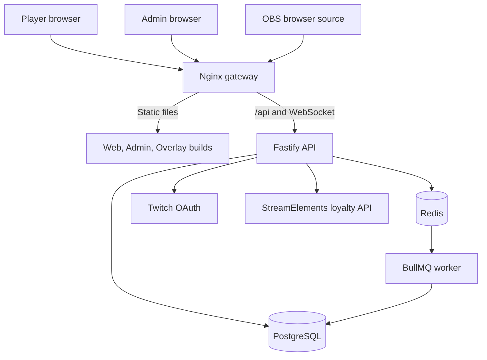

# Neon Wreckers: Station Zero

> A server-authoritative, mobile-first stream game built for Twitch interaction, live overlays, persistent station progression, salvage operations, expeditions, and streamer-controlled events.


Neon Wreckers combines a player-facing web game, streamer administration tools, an OBS browser overlay, a Fastify API, and an asynchronous worker into one production deployment. Game state is authoritative on the server. Browser clients display state and request actions, but do not calculate rewards, choose loot, alter cooldowns, or mutate persistent data directly.

Version 2.0 uses the stabilized Sprint 1 repository as its canonical base. Phase 2 adds a shared production sci-fi interface system across the player, admin, and overlay surfaces without changing APIs, persistence, mechanics, costs, rewards, cooldowns, balance, or production topology.

## Contents

- [Current capabilities](#current-capabilities)
- [Architecture](#architecture)
- [Repository structure](#repository-structure)
- [Requirements](#requirements)
- [Local development](#local-development)
- [Production deployment](#production-deployment)
- [Public routes](#public-routes)
- [Configuration](#configuration)
- [Common commands](#common-commands)
- [Testing and verification](#testing-and-verification)
- [Backups, updates, and restores](#backups-updates-and-restores)
- [Documentation](#documentation)
- [Security](#security)
- [Development rules](#development-rules)
- [License and distribution](#license-and-distribution)

## Current capabilities

### Player application

- Twitch OAuth sign-in and database-backed sessions
- Persistent player, ship, crew, inventory, and station state
- Wreck scanning and salvage deployment
- Construction material contributions
- Expedition launching, resolution, and reward claiming
- Station history, server-persisted notifications, quarters layout, and marketplace views
- Responsive command interface backed by the shared UI component and theme system

### Streamer administration

- Streamer and administrator role enforcement
- Station and integration status
- Wreck spawning through the same authoritative salvage service used by normal gameplay
- Versioned configuration records and audit logging
- StreamElements loyalty health and transaction review support
- Live UI Library covering reusable components and interaction states

### OBS overlay

- Transparent browser-source interface
- Public station and history feeds
- Realtime WebSocket updates
- Source-controlled overlay configuration
- Central theme defaults with configurable panel placement, timing, optional color overrides, scanlines, glass, feed state, and breaking-news behavior

### Backend and operations

- Fastify API with validation, structured error envelopes, rate limiting, and request IDs
- PostgreSQL as the durable source of truth
- Redis and BullMQ for delayed expedition resolution
- Transactional protection for salvage, construction, expeditions, starter records, and content version allocation
- StreamElements point-action idempotency and compensation tracking
- Dockerized production deployment with Nginx TLS termination
- Supported install, update, verification, backup, and restore scripts

## Architecture



The gateway exposes four surfaces:

| Path | Purpose |
| --- | --- |
| `/` | Player application |
| `/admin/` | Streamer control center |
| `/overlay/` | OBS browser overlay |
| `/api/` | API and WebSocket proxy |

The API owns identity, game state, inventory, cooldowns, rewards, construction, expeditions, loyalty transactions, and administrative operations. PostgreSQL is the only durable runtime datastore. Redis is used for queue infrastructure and is not a second source of truth.

## Repository structure

```text
.
├── apps/
│   ├── web/                 Player-facing React application
│   ├── admin/               Streamer control center
│   ├── overlay/             OBS browser-source application
│   ├── api/                 Fastify API
│   └── worker/              BullMQ expedition worker
├── packages/
│   ├── game-engine/         Deterministic gameplay rules
│   ├── content/             Validated content loader and typed exports
│   ├── integrations/        Twitch, StreamElements, and Redis adapters
│   ├── browser-client/      Shared browser API client
│   ├── ui/                  Components, themes, icons, motion, and responsive layout
│   └── client-theme/        Compatibility stylesheet forwarding to UI
├── content/                 Canonical game content and balance data
├── assets/                  Canonical visual-key manifest
├── infrastructure/
│   ├── database/            Prisma schema, migrations, and seed
│   └── gateway/             Production Nginx configuration
├── scripts/                 Install, update, verify, backup, and restore
├── tools/                   Repository and content quality gates
├── docs/                    Architecture and operating documentation
├── Dockerfile               One multi-stage application build pipeline
└── compose.yaml             One supported production deployment
```

Each major directory contains its own README describing purpose, dependencies, architecture boundaries, and extension points.

## Requirements

### Development

- Node.js 22.16 or newer
- pnpm 10.32 or newer
- PostgreSQL 16 compatible server
- Redis 7 compatible server
- A Twitch development application for real OAuth sign-in

pnpm is the only supported package manager. `pnpm-lock.yaml` is canonical.

### Production

- Ubuntu 24.04 LTS host
- Public DNS hostname pointed at the host
- Inbound TCP ports 80 and 443
- Docker Engine with the Compose plugin
- Outbound HTTPS access for packages, container images, certificate issuance, Twitch, and StreamElements

## Local development

Install the locked workspace dependencies:

```bash
corepack enable
pnpm install --frozen-lockfile
```

Create local configuration:

```bash
cp .env.example .env
chmod 600 .env
```

Provide reachable local PostgreSQL and Redis services, then update `DATABASE_URL`, `REDIS_URL`, and the Twitch callback settings in `.env`.

Apply the database migration and seed:

```bash
pnpm run db:migrate
pnpm run db:seed
```

Run the backend processes:

```bash
pnpm --filter @neon-wreckers/api run dev
pnpm --filter @neon-wreckers/worker run dev
```

Run any browser client in a separate terminal:

```bash
pnpm --filter @neon-wreckers/web run dev
pnpm --filter @neon-wreckers/admin run dev
pnpm --filter @neon-wreckers/overlay run dev
```

The Vite clients use same-origin `/api` requests and proxy them to `http://127.0.0.1:8787` during development. Synthetic users and mock authentication are not supported.

## Production deployment

Neon Wreckers has exactly one supported production method: the root `compose.yaml`, built from the root `Dockerfile`.

Prepare the environment file:

```bash
cp .env.example .env
chmod 600 .env
```

Replace all example values, point the hostname at the server, then run:

```bash
sudo bash scripts/install.sh
```

The installer:

1. Validates the environment configuration.
2. Installs Docker and Certbot when required.
3. Validates the Compose configuration.
4. Builds the application and gateway images.
5. Obtains the TLS certificate.
6. Applies migrations and the idempotent seed.
7. Starts PostgreSQL, Redis, API, worker, and gateway services.
8. Installs certificate-renewal and daily-backup timers.
9. Checks the public health endpoints.

See [docs/DEPLOYMENT.md](docs/DEPLOYMENT.md) before operating a production host.

## Public routes

| Route | Access | Description |
| --- | --- | --- |
| `GET /health` | Public | API process health |
| `GET /ready` | Public | API and database readiness |
| `GET /api/v1/ws` | Public | Realtime WebSocket feed |
| `GET /api/v1/auth/twitch/start` | Public | Begin Twitch OAuth |
| `GET /api/v1/me` | Authenticated | Current user and player record |
| `GET /api/v1/station` | Public | Current station state |
| `POST /api/v1/salvage/scan` | Authenticated | Scan for a wreck |
| `POST /api/v1/salvage/deploy` | Authenticated | Run a salvage action |
| `POST /api/v1/construction/contribute` | Authenticated | Contribute materials |
| `GET /api/v1/expeditions` | Authenticated | List player expeditions |
| `POST /api/v1/expeditions/launch` | Authenticated | Launch an expedition |
| `POST /api/v1/expeditions/:id/claim` | Authenticated | Claim resolved rewards |
| `GET /api/v1/admin/config` | Streamer or admin | Read configuration records |
| `POST /api/v1/admin/config` | Streamer or admin | Save a configuration version |
| `POST /api/v1/admin/actions/spawn-wreck` | Streamer or admin | Spawn a wreck |

The complete route inventory and response format are documented in [docs/API_REFERENCE.md](docs/API_REFERENCE.md).

## Configuration

All production variables are documented in [docs/DEPLOYMENT.md](docs/DEPLOYMENT.md) and represented in [.env.example](.env.example).

Important groups include:

| Group | Variables |
| --- | --- |
| Public identity | `PUBLIC_HOST`, `PUBLIC_WEB_URL`, `CORS_ORIGINS`, `ACME_EMAIL` |
| Runtime | `NODE_ENV`, `TRUST_PROXY`, `COOKIE_SECURE`, `LOG_LEVEL`, rate-limit values |
| PostgreSQL | `POSTGRES_USER`, `POSTGRES_PASSWORD`, `POSTGRES_DB`, `DATABASE_URL` |
| Redis | `REDIS_PASSWORD`, `REDIS_URL` |
| Sessions | `SESSION_COOKIE_NAME`, `SESSION_SECRET` |
| Twitch | Client ID, client secret, redirect URI, scopes, streamer Twitch ID |
| StreamElements | Provider mode, channel ID, JWT, API base, points-action feature flag |
| Operations | `BACKUP_RETENTION_DAYS`, `IMAGE_TAG` |

Never commit `.env`, provider tokens, database dumps, backup archives, certificates, or support bundles containing secrets.

## Common commands

| Command | Purpose |
| --- | --- |
| `corepack enable` | Enable the package-manager shim supplied with Node |
| `pnpm install --frozen-lockfile` | Install exact locked dependencies |
| `pnpm run dev` | Start available workspace development processes |
| `pnpm run clean` | Remove generated output |
| `pnpm run build` | Build the database, shared packages, services, and three browser clients |
| `pnpm run test` | Run all automated source checks |
| `pnpm run verify` | Run tests followed by all builds |
| `pnpm run test:engine` | Test deterministic gameplay rules |
| `pnpm run test:api` | Test API and service behavior |
| `pnpm run test:content` | Validate content and cross-file references |
| `pnpm run test:dependencies` | Audit workspace dependency ownership |
| `pnpm run test:repository` | Enforce repository and deployment invariants |
| `pnpm run db:migrate` | Apply production Prisma migrations |
| `pnpm run db:seed` | Run the TypeScript development seed |
| `bash scripts/verify.sh` | Run the complete release verification gate |

## Testing and verification

Run the source-level gate:

```bash
pnpm run verify
```

Run the complete release gate:

```bash
bash scripts/verify.sh
```

The verification process checks:

- Deterministic gameplay rules
- API services and route behavior
- Content schemas and cross-file references
- Dependency ownership and unused packages
- Prisma schema and SQL migration parity
- Route inventory and duplicate-route protection
- Repository structure and deployment uniqueness
- Secret, recovery-file, generated-artifact, and unfinished-marker rejection
- TypeScript compilation
- Web, admin, and overlay production builds
- Shell-script syntax
- Docker Compose validation and image builds when Docker is available

Release evidence is recorded in [docs/TEST_REPORT.md](docs/TEST_REPORT.md) and [docs/DEPLOYMENT_VERIFICATION.md](docs/DEPLOYMENT_VERIFICATION.md).

## Backups, updates, and restores

### Update

```bash
sudo bash scripts/update.sh
```

The update process validates configuration, creates a backup, rebuilds images, applies migrations and seed data, replaces services, removes unused images, and checks HTTPS health.

### Backup

```bash
sudo bash scripts/backup.sh
```

Backups include the PostgreSQL dump, environment file, canonical content, asset manifest, and overlay configuration. Backup archives contain secrets and must be stored encrypted with restricted access.

### Restore

```bash
sudo bash scripts/restore.sh backups/neon-wreckers-YYYYMMDDTHHMMSSZ.tar.gz --confirm
```

Use `--restore-env` only when the archived environment must replace the current `.env`. The restore process rejects unsafe archive paths and verifies stored checksums before applying data.

## Documentation

| Document | Purpose |
| --- | --- |
| [Architecture Guide](docs/ARCHITECTURE.md) | Runtime boundaries, data flow, concurrency, authentication, and extension rules |
| [Developer Guide](docs/DEVELOPER_GUIDE.md) | Local development, code ownership, database changes, APIs, content, and dependencies |
| [Deployment Guide](docs/DEPLOYMENT.md) | Production installation, environment reference, updates, backups, and restores |
| [Admin Guide](docs/ADMIN_GUIDE.md) | Control-center access, StreamElements operations, audit review, and safe administration |
| [Overlay Guide](docs/OVERLAY_GUIDE.md) | OBS setup, overlay configuration, data flow, and troubleshooting |
| [API Reference](docs/API_REFERENCE.md) | Route inventory and API response conventions |
| [Database Domain Model](docs/DATABASE_DOMAIN_MODEL.md) | Persistent entities and relationships |
| [UI Design System](docs/UI_DESIGN_SYSTEM.md) | Reusable components, typography, icons, responsive layout, motion, and accessibility |
| [Theme Token Guide](docs/THEME_TOKEN_GUIDE.md) | Central theme configuration, CSS variables, seasonal themes, and overlay defaults |
| [Visual Guide](docs/FRONTEND_VISUAL_GUIDE.md) | Product visual language and screen-composition rules |
| [Phase 2 UI Report](docs/PHASE_2_UI_REPORT.md) | Rebuilt Phase 2 scope, protected source areas, and deliverables |
| [Dependency Audit](docs/DEPENDENCY_AUDIT.md) | Purpose and status of retained dependencies |
| [Test Report](docs/TEST_REPORT.md) | Automated verification results |
| [Deployment Verification](docs/DEPLOYMENT_VERIFICATION.md) | Release deployment evidence and environment-dependent gates |
| [Change Summary](docs/CHANGE_SUMMARY.md) | Sprint 1 stabilization and rebuilt Phase 2 interface changes |
| [Changelog](CHANGELOG.md) | Version history |

## Security

- Twitch OAuth state and application sessions use signed, HTTP-only cookies.
- Session bearer values are random and stored only as SHA-256 hashes.
- Viewer Twitch tokens are transient; the streamer's renewable EventSub authorization is encrypted at rest with a separate credential key.
- StreamElements credentials remain server-side.
- Point-funded actions require idempotency keys and durable transaction records.
- Nginx terminates TLS, redirects HTTP to HTTPS, and proxies WebSocket upgrades.
- State-changing operations use database locks or conditional transitions where concurrency could duplicate rewards or spend inventory twice.

The source imported before Version 2.0 contained committed environment files with live-looking credentials. Rotate every database, Redis, session, Twitch, StreamElements, and related credential that appeared in an earlier package before deploying this version.

For security-sensitive reports, use a private channel rather than a public issue.

## Development rules

- Keep gameplay authoritative on the server.
- Put deterministic mechanics in `packages/game-engine` and add deterministic tests.
- Put content and balance values in the canonical content files rather than duplicating them in routes.
- Put provider-specific code in `packages/integrations`.
- Add persistent behavior through the Prisma schema and a named SQL migration.
- Keep route modules thin and call domain services rather than other HTTP routes.
- Use exact dependency versions and add each package only to the workspace that imports it.
- Add every referenced content visual key to `assets/manifest.json`.
- Build browser screens with `@neon-wreckers/ui`; add reusable primitives, semantic icons, and seasonal values there instead of creating app-local visual systems.
- Do not add alternate Compose files, recovery installers, source-mounted production containers, mock authentication, synthetic loyalty providers, or committed build output.
- Run the complete verification gate before merging changes.

## License and distribution

This repository is marked private and does not include an open-source license. Unless the project owner publishes separate terms, the source code, artwork, content, branding, and deployment materials are proprietary and may not be redistributed or reused outside the authorized Neon Wreckers project.
